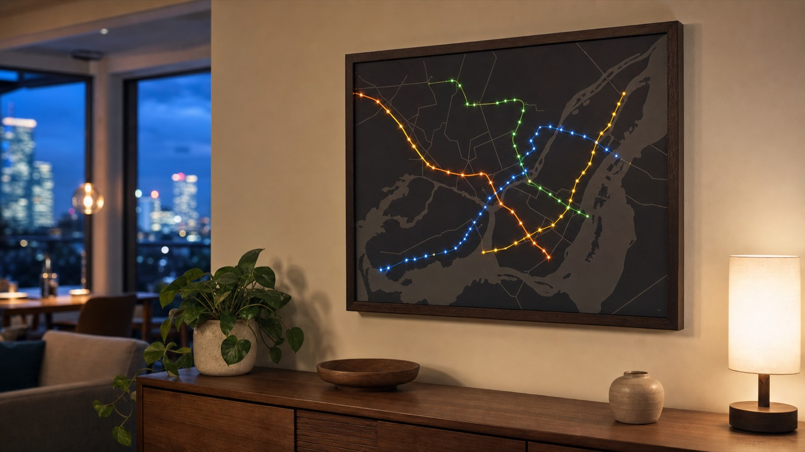
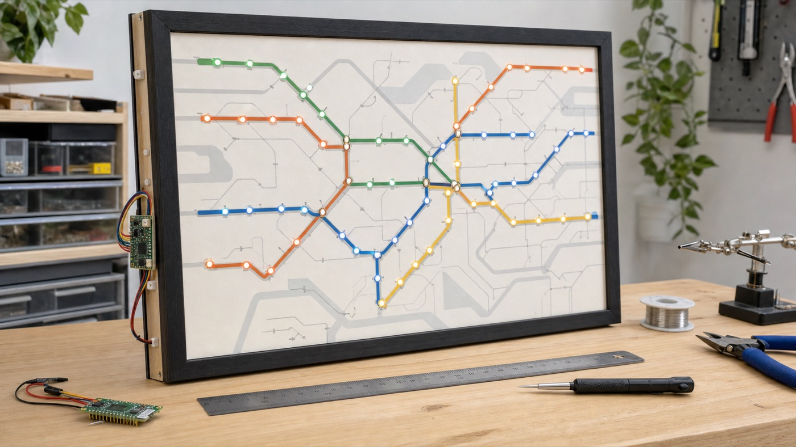

<p align="center">
  
</p>

<h1 align="center">Cadre lumineux du métro de Montréal</h1>

<p align="center">
  Un cadre mural 18 × 24 po qui anime les passages théoriques du métro et
  signale les perturbations du réseau avec 68 DEL et un Raspberry Pi Pico 2 W.
</p>

<p align="center">
  <strong>Français</strong> ·
  <a href="docs/README_EN.md">English</a> ·
  <a href="docs/README_ES.md">Español</a> ·
  <a href="docs/README_IT.md">Italiano</a>
</p>

<p align="center">
  
  
  
  
</p>

> Les positions affichées sont des estimations calculées à partir des horaires
> GTFS. La STM ne publie pas la position réelle de ses trains de métro. Les
> interruptions et perturbations proviennent toutefois de son API d’état du
> service.

## Le projet en un regard

```text
Horaires GTFS de la STM ─┐
                         ├─→ Pico 2 W ─→ signal DATA ─→ 68 pixels WS2811
État du service STM ─────┘       │
                                 ├─→ assistant de première installation
                                 └─→ panneau de contrôle sur le réseau local
```

Le Pico calcule localement les passages probables à l’heure de Montréal. Il
n’a besoin ni d’un ordinateur ni d’un serveur personnel une fois installé. Le
Wi-Fi sert à synchroniser l’horloge, lire l’état du service et vérifier
périodiquement si un horaire compact plus récent est disponible.

## Ce qu’il faut prévoir

### Matériel électronique

| Quantité | Composant | Remarque |
|---:|---|---|
| 1 | Raspberry Pi Pico 2 W avec broches | Exécute MicroPython et pilote les pixels |
| 68 | Pixels adressables WS2811, 12 mm, 5 V | Deux guirlandes de 50 conviennent; seuls 68 pixels sont utilisés |
| 1 | Source USB 5 V de qualité | Prévoir idéalement 3 A ou plus pour garder une marge confortable |
| 1 | `74AHCT125` ou convertisseur logique équivalent | Rend le signal 3,3 V du Pico fiable pour les pixels 5 V |
| 1 | Résistance de 330 à 470 Ω | Se place en série sur DATA, près du premier pixel |
| 1 | Condensateur d’environ 1 000 µF, 6,3 V ou plus | Recommandé entre +5 V et GND près du début de la chaîne |
| — | Fils, connecteurs et plaque d’essai ou plaque à souder | Le GND du Pico et celui des pixels doivent être communs |

Le logiciel limite la luminosité et estime le courant, mais il ne peut pas
protéger contre un court-circuit, une inversion de polarité ou une alimentation
de mauvaise tension.

### Affiche et cadre

- une impression **18 × 24 po** à l’échelle 100 %, de préférence mate;
- un panneau rigide mince, par exemple un carton mousse de 3 à 5 mm;
- 68 ouvertures adaptées aux pixels de 12 mm;
- un cadre assez profond pour loger les fils, le Pico et la petite carte
  électronique;
- un panneau arrière amovible pour l’entretien.

Une moulure à onglets de 45° peut recevoir deux rainures : une glissière avant
pour l’affiche montée sur son panneau et une glissière arrière pour le fond
amovible. Cette construction garde l’affiche plane et empêche son déplacement
sans la coller définitivement au cadre.

## Construire le cadre

### 1. Préparer l’affiche

1. Imprimer à **18 × 24 po**, sans l’option « ajuster à la page ».
2. Monter l’impression bien à plat sur le carton mousse.
3. Marquer le centre des 68 stations depuis l’avant.
4. Faire d’abord un essai dans une retaille du même matériau.
5. Percer ou emporte-piécer chaque ouverture à 12 mm, sans agrandir les
   stations imprimées plus que nécessaire.

### 2. Installer les pixels

1. Débrancher toute alimentation.
2. Insérer les pixels depuis l’arrière et numéroter leur ordre électrique de
   `0` à `67` avec du ruban-cache.
3. Respecter le sens `DATA IN → DATA OUT`; la couleur des fils n’est pas une
   garantie de leur fonction.
4. Relier la sortie du pixel 49 à l’entrée de la deuxième guirlande. Les 18
   pixels suivants deviennent les indices 50 à 67.
5. Fixer les fils sans exercer de traction sur les pixels ni sur le Pico.

L’ordre physique peut serpenter librement derrière l’affiche. L’assistant Web
permet ensuite d’indiquer quelle station correspond à chaque index électrique.

### 3. Câbler l’électronique

```text
Pico alimenté par USB

GP0 ─→ entrée 74AHCT125 ─→ résistance 330–470 Ω ─→ DATA IN du pixel 0
GND ─────────────────────────────────────────────→ GND des pixels
Source 5 V ──────────────────────────────────────→ +5 V des pixels
```

Le `74AHCT125` est alimenté en 5 V et son entrée d’activation utilisée doit
être maintenue active. Consulte le
[guide technique détaillé](docs/GUIDE_FR.md#signal-data) avant la mise sous
tension pour le montage complet.

> Ne branche jamais la chaîne de pixels sur `3V3`. Coupe toujours
> l’alimentation avant de déplacer un fil. Sur certaines plaques d’essai, les
> rails d’alimentation sont coupés au milieu : vérifie leur continuité.

### 4. Tester avant l’assemblage final

Teste d’abord quelques pixels à faible luminosité, puis les 68. Une fois le
câblage validé, installe l’électronique sur des entretoises et laisse l’USB, le
bouton `BOOTSEL` et les connecteurs accessibles depuis l’arrière.

## Une seule version, quatre langues

L’assistant de première configuration est intégré dans une seule page légère.
Il :

- détecte automatiquement la langue du téléphone ou de l’ordinateur;
- propose le français, l’anglais, l’espagnol et l’italien;
- permet de changer de langue à tout moment;
- mémorise le choix dans le navigateur;
- conserve les noms officiels des stations;
- n’ajoute aucune tâche permanente pendant le fonctionnement normal.

La page complète pèse environ **26 ko** et n’est chargée que lorsqu’un nouveau
cadre doit associer ses DEL aux stations.

## Ce que le cadre fait

| Fonction | Résultat |
|---|---|
| Trains théoriques | Marqueurs francs qui passent de station en station, dans le style Metroboard |
| État du réseau | Ralentissements et interruptions lus toutes les 60 secondes |
| Mode nuit | Respiration lente et douce après le dernier passage prévu |
| Première installation | Assistant Web qui identifie chaque DEL sans imposer l’ordre du câblage |
| Panneau de contrôle | Réglages, diagnostics, tests et redémarrage depuis le réseau local |
| Protection | Luminosité et courant estimé plafonnés par logiciel |
| Mise à jour GTFS | Téléchargement validé par SHA-256 avec sauvegarde et restauration |
| Simulation | Même animation visible localement dans un navigateur avant le branchement |

## Démarrage rapide

### 0. Télécharger le projet

Clone le dépôt ou télécharge son archive ZIP depuis GitHub :

```bash
git clone https://github.com/nvldboy/cadre-metro-montreal.git
cd cadre-metro-montreal
```

Le dossier `PICO_2_W_PRET_A_COPIER` est la voie la plus simple. Le dossier
`pico` contient les mêmes sources sous leur forme de développement.

### 1. Préparer le Pico

Installe [MicroPython pour le Pico 2 W](https://micropython.org/download/RPI_PICO2_W/),
puis ouvre Thonny avec l’interpréteur **MicroPython (Raspberry Pi Pico)**.

### 2. Configurer les accès locaux

Dans [`pico/`](pico), duplique `secrets.example.py` sous le nom `secrets.py`,
puis inscris :

```python
WIFI_NETWORKS = [
    ("NOM_DU_WIFI", "MOT_DE_PASSE"),
]

STM_API_KEY = "CLE_API_STM"
CONTROL_PANEL_PIN = "CHOISIR_UN_NIP"
```

`secrets.py` est ignoré par Git : il ne sera jamais publié par erreur.

### 3. Copier le programme

Copie le contenu du dossier [`pico/`](pico) à la racine `/` du Pico avec
Thonny. Une copie organisée se trouve aussi dans
[`PICO_2_W_PRET_A_COPIER/`](PICO_2_W_PRET_A_COPIER).

### 4. Associer les DEL

Au premier démarrage :

1. connecte ton téléphone au réseau `Metro-Setup`;
2. utilise le mot de passe `metro-led-68`;
3. ouvre `http://192.168.4.1`;
4. choisis ta langue;
5. indique la station placée devant chaque DEL qui clignote;
6. enregistre : le Pico redémarre automatiquement.

L’ordre physique des DEL n’a donc pas besoin de suivre l’ordre géographique des
stations.

### 5. Ouvrir le panneau de contrôle

Lorsque les trains fonctionnent, ouvre `http://ADRESSE_IP_DU_PICO/admin` sur un
appareil connecté au même Wi‑Fi. Le Pico imprime son adresse dans Thonny au
démarrage. Entre le `CONTROL_PANEL_PIN` défini dans `secrets.py`; si cette ligne
est absente, le NIP initial est `metro68`.

Le panneau permet de régler les luminosités, forcer le jour, la nuit ou
l’extinction, tester les DEL, relire la STM, vérifier le GTFS, reconnecter le
Wi‑Fi, réinitialiser les stations et redémarrer le Pico. Les réglages sont
conservés dans `user_settings.json` et l’animation continue pendant son
utilisation.

### 6. Tester sans matériel

```bash
python3 simulator/server.py
```

Ouvre ensuite :

- simulateur : `http://127.0.0.1:8765/`;
- assistant initial : `http://127.0.0.1:8765/setup-preview`;
- panneau de contrôle : `http://127.0.0.1:8765/admin-preview` avec le NIP
  `metro68`;
- aperçu espagnol direct : `http://127.0.0.1:8765/setup-preview?lang=es`.

### 7. Valider le logiciel

Avant de copier une modification sur le matériel, exécute les tests depuis la
racine du projet :

```bash
python3 -m unittest discover -s tests
```

Après une modification des fichiers destinés au Pico, recalcule le manifeste
SHA-256 du livrable simplifié :

```bash
python3 scripts/update_package_manifest.py
```

Une mise en marche réussie suit normalement cette séquence : autotest blanc,
connexion Wi-Fi cyan, synchronisation de l’heure, puis apparition progressive
des trains théoriques. Au tout premier démarrage, l’assistant d’association
remplace l’animation normale.

## Dépannage rapide

| Symptôme | Vérifications prioritaires |
|---|---|
| Aucune DEL ne s’allume | Présence du 5 V, GND commun, sens `DATA IN`, GP0 et activation du `74AHCT125` |
| Seulement le premier pixel réagit | Connecteur entre les guirlandes, sens des données ou premier pixel suivant défectueux |
| Couleurs incorrectes | Valeur `PIXEL_SWAP_RED_GREEN` dans `pico/config.py` et ordre réel des canaux du fabricant |
| Couleurs rouges ou instables au bout de la chaîne | Chute de tension; injecter 5 V et GND au début de la seconde guirlande |
| Le Pico fonctionne dans Thonny, mais pas sur le chargeur | Vérifier que `main.py` est à la racine, puis observer un démarrage complet dans Thonny |
| Aucun Wi-Fi ne se connecte | Orthographe exacte, apostrophes, réseau 2,4 GHz et réseaux de secours dans `WIFI_NETWORKS` |
| L’assistant revient à chaque démarrage | Vérifier que `led_mapping.json` a bien été enregistré sur le Pico |
| Le panneau `/admin` refuse l’accès | Utiliser le NIP de `CONTROL_PANEL_PIN`; redémarrer après une modification de `secrets.py` |
| Les trains semblent figés | Vérifier l’heure NTP, la validité de l’horaire GTFS et l’état affiché dans `/admin` |
| L’API STM échoue, mais les trains bougent | L’horaire local continue de fonctionner; vérifier la clé STM et réessayer depuis le panneau |

Le [guide technique complet](docs/GUIDE_FR.md) contient les commandes de test,
les diagnostics électriques et la procédure de réinitialisation des stations.

## Signification des animations

| Animation | Signification |
|---|---|
| Une station vivement colorée | Présence estimée d’un train |
| Point qui saute à la station suivante | Déplacement estimé d’un train, représenté par une seule DEL nette |
| Changements répartis sur le réseau | Chaque rame suit son propre horaire légèrement désynchronisé |
| Blanc | Correspondance entre plusieurs lignes |
| Pulsation ambre | Service ralenti ou perturbé |
| Deux éclats rouges | Ligne interrompue |
| Trois éclats rouges sur une DEL | Station fermée |
| Balayage dans la couleur d’une ligne | Reprise du service |
| Chenillard cyan | Connexion ou reconnexion Wi-Fi |
| Magenta long–court–court | Configuration absente ou invalide |
| Respiration à environ 0,1–0,45 % | Mode nuit après le dernier train |

Le simulateur contient maintenant des aperçus séparés pour le démarrage, le
Wi-Fi, la synchronisation de l’heure, les erreurs GTFS, les mises à jour et la
protection électrique.

## Matériel et sécurité

Le projet cible 68 pixels WS2811 de 12 mm alimentés en **5 V** et un Pico 2 W.
Les DEL et le Pico peuvent partager une même batterie USB, mais les DEL doivent
recevoir leur propre branche 5 V correctement dimensionnée.

- Ne fais jamais passer le courant des DEL dans la broche `3V3` du Pico.
- Relie obligatoirement la masse du Pico à celle des DEL.
- Coupe l’alimentation avant de modifier un fil.
- Commence avec la luminosité limitée fournie par le logiciel.
- Vérifie le sens `DATA IN → DATA OUT` de chaque guirlande.

Le [guide technique complet](docs/GUIDE_FR.md) contient le schéma de câblage,
l’installation détaillée, les diagnostics et les limites électriques.

## Inspiration

<table>
  <tr>
    <td width="50%">
      
    </td>
    <td width="50%">
      
    </td>
  </tr>
  <tr>
    <td align="center">Intégration murale chaleureuse</td>
    <td align="center">Construction accessible en atelier</td>
  </tr>
</table>

Ces images sont des **visualisations conceptuelles originales**. Elles servent
d’inspiration et ne représentent pas exactement le tracé final, les proportions
des composants ni une œuvre commerciale existante.

## Organisation du projet

| Dossier | Contenu |
|---|---|
| [`pico/`](pico) | Programme MicroPython installé sur le Pico |
| [`simulator/`](simulator) | Simulation Web locale et aperçu de l’assistant |
| [`tests/`](tests) | Tests automatisés du logiciel |
| [`scripts/`](scripts) | Conversion et publication du GTFS |
| [`updates/`](updates) | Horaire compact et manifeste destinés au Pico |
| [`PICO_2_W_PRET_A_COPIER/`](PICO_2_W_PRET_A_COPIER) | Livrable simplifié pour Thonny |
| [`docs/`](docs) | Guides traduits et documentation détaillée |

## Documentation

- [Guide technique détaillé en français](docs/GUIDE_FR.md)
- [English quick start](docs/README_EN.md)
- [Guía rápida en español](docs/README_ES.md)
- [Guida rapida in italiano](docs/README_IT.md)

## Données et confidentialité

Les horaires planifiés proviennent de la Société de transport de Montréal et
sont distribués sous licence CC BY 4.0. Les secrets Wi-Fi et API demeurent
uniquement dans le fichier local `secrets.py`.

Le dépôt peut rester privé et être partagé avec des collaborateurs GitHub.
Les mises à jour d'horaire accessibles au Pico sont publiées séparément dans le
dépôt public
[`cadre-metro-montreal-updates`](https://github.com/nvldboy/cadre-metro-montreal-updates),
qui ne contient aucun mot de passe ni aucune clé API.
